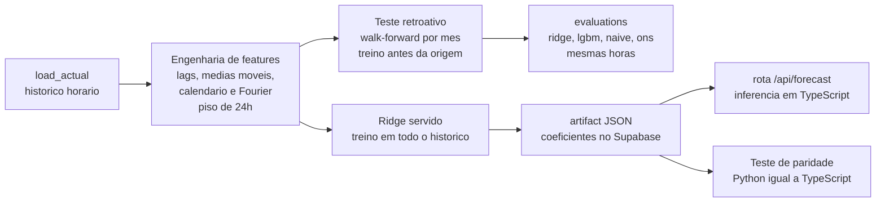
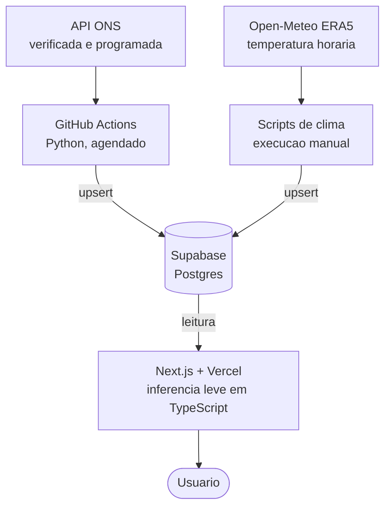
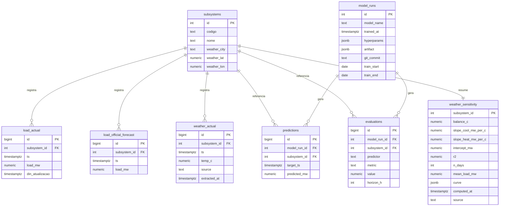

# Previsão de carga do SIN: modelo vs ONS

Aplicação web que prevê a carga elétrica horária do dia seguinte por subsistema do Sistema Interligado Nacional (SIN) e mede a qualidade dessa previsão contra dois baselines: um modelo ingênuo sazonal e a previsão oficial programada do próprio ONS. Todos avaliados exatamente sobre as mesmas horas.

App no ar: https://desafio-squad-pandas.vercel.app

---

## Metodologia geral

A meta não é desenhar um gráfico de previsão, e sim sustentar uma afirmação que pode ser medida: de quanto o modelo erra, e como esse erro se compara ao de quem já faz essa previsão de forma oficial, o ONS. Tudo gira em torno de tornar essa comparação justa.

O ponto de partida é prever a carga das 24 horas do dia seguinte, no grão horário, para cada um dos quatro subsistemas (SE/CO, Sul, Nordeste e Norte). Como os perfis de consumo variam muito entre regiões, treina-se um modelo por subsistema, em vez de um modelo único com variáveis indicadoras.

A regra que torna a comparação honesta é o piso de 24 horas. Para prever a carga de uma hora alvo, nenhuma feature de carga pode tocar dado nas 24 horas que a antecedem. É isso que mantém o modelo no mesmo terreno do ONS, que também prevê o dia seguinte sem conhecer o que vai acontecer. Sem esse piso, o modelo viraria um preditor de uma hora à frente, artificialmente bom e injusto contra a programada.

Sobre essa base, monta-se uma escada de modelos, do mais simples ao mais forte: o ingênuo sazonal (repetir a carga da mesma hora da semana anterior), a programada oficial do ONS, o Ridge (linear regularizado) e o LightGBM (gradient boosting). O Ridge é leve e seus coeficientes cabem num JSON, então é ele que vai servido ao vivo. O LightGBM costuma ser o mais preciso e é o campeão reportado na comparação.

A avaliação usa um teste retroativo que simula previsões dia após dia (walk-forward). Em vez de embaralhar o tempo, o que vazaria o futuro no passado, o treino avança em origens mensais: a cada origem, o modelo só enxerga alvos estritamente anteriores a ela e prevê o bloco seguinte, como em produção. Os quatro preditores são medidos exatamente nas mesmas horas, e o resultado fica gravado na tabela `evaluations`.

Por fim, há uma separação deliberada entre treino e inferência. O trabalho pesado em Python roda fora da Vercel, num job agendado do GitHub Actions, que grava no Supabase. A aplicação só faz a conta leve: a rota `/api/forecast` lê os coeficientes do Ridge servido e reconstrói as features em TypeScript, em milissegundos. Para garantir que a conta em TypeScript é idêntica à do Python, um teste de paridade confere cada feature e cada previsão contra casos de referência.

O fluxo de ponta a ponta da metodologia:



---

## O problema

Prever a carga do dia seguinte (24 horas, grão horário) para os quatro subsistemas do SIN. A previsão sozinha não diz nada sem uma régua. Por isso o projeto não entrega "um gráfico de previsão", e sim uma afirmação mensurável:

> O modelo erra X% (MAPE); o ingênuo sazonal erra Y%; a programada do ONS erra Z%, todos sobre as mesmas horas de teste.

A existência de um baseline real e honesto, a programada que o ONS de fato publica, é o diferencial central: a comparação é justa porque tanto o modelo quanto o ONS preveem o dia seguinte com a mesma informação disponível.

## Fonte dos dados

API pública do ONS (`apicarga.ons.org.br`), em dois endpoints irmãos da mesma base, por área de carga:

- **Carga verificada** (`cargaverificada`, campo `val_cargaglobal`): o alvo real.
- **Carga programada** (`cargaprogramada`, campo `val_cargaglobalprogramada`): o baseline oficial do ONS.

Usar os dois da mesma API garante mesmo grão e mesma base. Regras de tratamento na ingestão:

- **Grão**: o ONS entrega dado semi-horário; agregamos para horário pela média das duas semi-horas, casando com o horizonte horário.
- **Fuso**: `din_referenciautc` vem em UTC; convertemos para Brasília (UTC menos 3, fixo, sem horário de verão no Brasil desde 2019). A hora-rótulo guarda o início do intervalo.
- **Não-medição**: valores 0 ou nulos representam horas ainda não medidas e são descartados. Horas faltantes ficam explícitas, sem inventar valor.
- **Idempotência**: gravação com `upsert` por `(subsystem_id, ts)`, então reingestão nunca duplica. A janela móvel diária reingere os últimos dias para capturar reconsolidações do ONS.

## Arquitetura

O princípio central é separar treino de inferência, porque as bibliotecas de previsão são Python e a Vercel só comporta funções curtas:



O trabalho pesado (Python) roda fora da Vercel, num job agendado do GitHub Actions, que também funciona como keep-alive do Supabase: escreve no banco todo dia, impedindo a pausa por inatividade. A Vercel só faz a inferência leve. A rota `/api/forecast` lê os coeficientes do Ridge servido (JSON no Supabase), monta o vetor de features em TypeScript e calcula `ŷ = intercepto + Σ wᵢ·xᵢ` em milissegundos, sem Python no tempo de execução.

> **Paridade Python e TypeScript**: a engenharia de features no serviço (TS) reproduz exatamente a do treino (Python). Um teste de paridade automatizado (`web/scripts/parity-test.ts`) confere, sobre casos de referência gerados pelo Python, que cada feature e cada previsão batem com o original.

## Modelo de dados (Supabase)

Oito tabelas: seis para a carga e a previsão, mais duas para a camada de temperatura. A comparação entre preditores é cidadã de primeira classe.



| Tabela | Papel |
|---|---|
| `subsystems` | Dimensão dos 4 subsistemas (SECO, S, NE, N) e a cidade-âncora de temperatura de cada um. |
| `load_actual` | Carga verificada horária (o alvo). |
| `load_official_forecast` | Carga programada do ONS (baseline oficial). |
| `model_runs` | Versionamento de modelo: hiperparâmetros, janela de treino, `git_commit` e o `artifact` (coeficientes do Ridge servido). |
| `predictions` | Saída do modelo por hora-alvo, versionada por execução. |
| `evaluations` | Métricas por subsistema, `predictor` (`ridge`, `lgbm`, `naive`, `ons`) e `metric` (`mape`, `mae`, `rmse`). |
| `weather_actual` | Temperatura horária da cidade-âncora de cada subsistema. |
| `weather_sensitivity` | Resultado da análise de sensibilidade, uma linha por subsistema. |

A coluna `predictor` em `evaluations` é o que torna a comparação direta: todos os competidores moram na mesma estrutura. Leitura pública via RLS, já que o painel é só-leitura.

## Modelagem e validação

Um modelo por subsistema, porque os perfis de carga diferem demais entre regiões para um modelo único.

### Regra anti-vazamento (o que torna a comparação válida)

Previsão do dia seguinte: no fim do dia D, prever as 24h de D+1 usando apenas o que já era conhecido em D. Daí o piso de 24h: nenhuma feature de carga toca dado no intervalo `(t menos 24h, t]` para prever a hora-alvo `t`. Sem esse piso, o modelo viraria um preditor de uma hora à frente, artificialmente bom e injusto contra a programada do ONS, que é genuinamente do dia seguinte.

### Escada de modelos

1. **Ingênuo sazonal**: `ŷ(t) = carga(t menos 168h)` (mesma hora, semana anterior). O piso a ser batido.
2. **Programada ONS**: a previsão oficial. A barra a perseguir.
3. **Ridge** (linear regularizado): interpretável, rápido, e com coeficientes que serializam para JSON. É o modelo servido ao vivo pela `/api/forecast`.
4. **LightGBM** (gradient boosting): capta não-linearidades. É o campeão reportado na comparação.

### Teste retroativo simulando previsões dia após dia (walk-forward)

Validação cruzada aleatória é proibida em série temporal (embaralhar vaza o futuro no passado). Usamos a janela deslizante de origem:

- Origens de re-treino no início de cada mês do período de teste, com janela de treino expansível.
- Em cada origem `O`, o treino usa alvos estritamente anteriores a `O` (nenhuma hora prevista é vista no treino) e prevê o bloco `[O, próxima O)`.
- Os preditores são avaliados nas mesmas horas, única forma de a comparação ser honesta.

O `pipeline/src/model.py` grava três execuções por subsistema: `ridge_v1` e `lgbm_v1` (com `predictions` e `evaluations` do retroativo) e `ridge_v1_served` (o artifact treinado em todo o histórico, para a inferência em TS).

## Resultados

MAPE do campeão (LightGBM) contra a programada do ONS, no teste retroativo de 12 meses:

| Subsistema | LightGBM | ONS | Vencedor |
|---|---|---|---|
| SE/CO | 2,80% | 2,28% | ONS |
| Sul | 4,13% | 4,22% | **Modelo** |
| Nordeste | 2,45% | 2,62% | **Modelo** |
| Norte | 2,42% | 2,27% | ONS |

A leitura honesta é o que dá força ao projeto: o ONS lidera onde já é muito preciso (SE/CO e Norte), e o modelo alcança e supera o ONS justamente nas duas regiões onde prever é mais difícil (Sul e Nordeste, de maior erro). Atingir o operador nacional onde ele mais sofre é um resultado defensável.

## Sensibilidade à temperatura

Uma camada explicativa, separada do modelo de previsão, que mede quanto a carga responde ao calor e ao frio em cada subsistema. Ela não entra no modelo, no teste de paridade nem no placar de MAPE. Existe para dar contexto físico ao consumo.

- **Fonte**: arquivo ERA5 da Open-Meteo (sem chave, CC BY 4.0), temperatura horária de uma cidade representativa por subsistema (São Paulo para SE/CO, Porto Alegre para o Sul, Recife para o Nordeste, Belém para o Norte).
- **Método**: para cada subsistema, agrega-se carga e temperatura ao grão diário e ajusta-se uma regressão por ponto de equilíbrio. Busca-se em grade a temperatura de equilíbrio que maximiza o R²: abaixo dela a carga sobe por aquecimento, acima dela sobe por refrigeração. As duas inclinações são forçadas a ser não negativas (via `scipy.optimize.lsq_linear`), o que elimina o artefato de inclinação negativa que surgia em regiões tropicais de pouca demanda de aquecimento.
- **Saída**: o resultado fica em `weather_sensitivity`, uma linha por subsistema, e alimenta o mapa e a curva de resposta no painel.

A leitura regional aparece no painel: o Sul é o único com demanda relevante de aquecimento (a carga sobe tanto no calor quanto no frio), enquanto os demais respondem essencialmente à refrigeração. A sensibilidade relativa (percentual da carga por grau) permite comparar subsistemas de portes diferentes na mesma escala.

## Como rodar

**Pipeline (Python).** Requer `DATABASE_URL` do Supabase num `.env` na raiz.

```bash
pip install -r pipeline/requirements.txt

# Ingestao da carga (janela movel padrao dos ultimos ~10 dias; backfill com --inicio/--fim)
python pipeline/ingest_verificada.py --codigo SECO
python pipeline/ingest_programada.py --codigo SECO

# Treino, teste retroativo e artifact servido (por subsistema)
python pipeline/src/model.py --codigo SECO
```

**Camada de temperatura (opcional, manual).** Gera um retrato estático: backfill da temperatura e análise de sensibilidade.

```bash
python pipeline/ingest_weather.py
python pipeline/analyze_weather.py
```

**Aplicação web (Next.js).** Em `web/.env.local`: `NEXT_PUBLIC_SUPABASE_URL` e `NEXT_PUBLIC_SUPABASE_PUBLISHABLE_KEY`.

```bash
cd web
npm install
npm run dev      # desenvolvimento
npm run build    # validacao estrita (sempre antes de publicar)
```

## Limitações

- **Feriados móveis ausentes**: `pipeline/data/holidays_br.json` (2023 a 2027) cobre feriados nacionais fixos mais a Sexta-feira Santa, mas não inclui Carnaval nem Corpus Christi. Esses dias caem no balde "dia útil" no recorte de erro por tipo de dia.
- **Atraso de publicação do ONS**: a carga verificada é publicada com defasagem, e reconsolidada depois. Mesmo com o pipeline rodando, é normal o gráfico ficar um ou dois dias atrás do calendário. Isso é da fonte, não do sistema.
- **Falha de 24h na programada de NE/N**: um intervalo de 24h sem programada nesses subsistemas é tratado como não-medição na origem, resolvido por inner join, sem imputação.
- **Modelo servido vs campeão**: a `/api/forecast` serve o Ridge (linear, serializável para inferência em TS); o LightGBM é o campeão reportado na comparação, mas não é servido ao vivo, porque não roda barato em TypeScript.
- **Sensibilidade à temperatura é um retrato estático**: o backfill da temperatura e a análise rodam sob demanda, fora do pipeline diário, então os números não se atualizam sozinhos. Além disso, cada subsistema é representado por uma única cidade-âncora, não pela média regional.

## Stack

Cursor (IDE assistida por IA), Python (pandas, numpy, scikit-learn, LightGBM, scipy), Supabase (Postgres), Next.js com Recharts, Vercel e GitHub Actions.

```
pipeline/    ingestao (ingest.py + wrappers), modelagem (model.py),
             clima (ingest_weather.py, analyze_weather.py), feriados e casos de paridade
supabase/    migrations do schema (6 tabelas de carga + 2 de clima, com RLS)
web/         app Next.js: painel, /api/forecast, inferencia em TS (lib/forecast),
             secao de sensibilidade e mapa
```